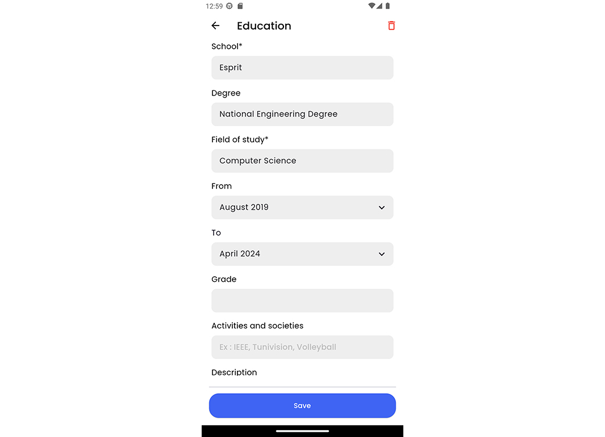

# Job and CV Management Platform

## Project Overview
This mobile application is designed to streamline job searching and recruitment processes. It provides a seamless experience for job seekers and recruiters with features like CV creation, job application tracking, messaging, and swiping through candidate profiles. The app is built using **Flutter**, following **Clean Architecture** principles to ensure maintainability and scalability.

---

## Screenshots and Interface Descriptions

### 1. Create New Account
This screen allows users to sign up for the platform by entering basic account details. Users can set their account type (job seeker or recruiter) during registration.

---

### 2. Job Preferences
Users can specify their job preferences, such as job type, expertise level, and skills. This information personalizes the job suggestions displayed on the home screen.

---

### 3. Job Seeker Home
The main dashboard for job seekers. It showcases personalized job recommendations based on the user's profile and preferences.

---

### 4. Filter and Search
Users can refine job searches using filters like location, salary range, and experience level. This feature helps users quickly find relevant job postings.

---

### 5. Saved Jobs
The saved jobs section enables job seekers to bookmark positions they're interested in for later review.

---

### 6. Job Application Status
Users can track the status of their job applications, including whether they're under review, shortlisted, or rejected.

---

### 7. Recruiter Job Post Management
Recruiters can manage their job postings, including reviewing applications submitted by job seekers.

---

### 8. Messaging Interface
The messaging screen facilitates communication between recruiters and job seekers. It supports real-time conversations to discuss job details and expectations.

---

### 9. Profile Management
Users can view and edit their profiles, including contact information, summaries, skills, and work experiences. This section is crucial for presenting a strong professional profile.

---

### 10. Candidate Finder
For recruiters, this screen displays candidate profiles. Recruiters can swipe right to shortlist candidates or left to skip.

---

### 11. Application Management
This interface is tailored for recruiters to view, sort, and manage applications for their posted jobs.

---

### 12. Recruiter Profile
Recruiters can edit their company details, including company name, description, and contact information.

---

### 13. Contact Information
Users can update their email, phone number, and other contact details. This ensures they remain reachable to potential employers or candidates.

---

### 14. Summary Section
The summary section allows users to add a professional overview or personal statement, highlighting their career objectives and key accomplishments.

---

### 15. Work Experience
Users can list their professional experiences, specifying job titles, responsibilities, and durations.

---

### 16. Education
This section enables users to add their academic qualifications, including degrees, institutions, and graduation dates.

---

### 17. Projects
Users can highlight notable projects they've worked on, providing details about their roles and achievements.

---

### 18. Languages
Users can add languages they are proficient in, enhancing their profile for roles requiring specific language skills.

---

### 19. Skills
Users can list their skills, which are key to matching them with relevant job postings.

---

## Features Highlight
- **Clean Architecture**: Ensures the codebase is modular and maintainable.
- **Swipe Feature**: Intuitive swiping mechanism for recruiters to manage candidates quickly.
- **Real-Time Messaging**: Facilitates seamless communication between users.
- **Personalized Recommendations**: Matches job seekers with relevant opportunities based on their profile.

---

## How to Run the Project
1. Clone the repository.
2. Ensure you have Flutter installed on your machine.
3. Run `flutter pub get` to install dependencies.
4. Use `flutter run` to launch the app on your preferred device or emulator.

---

## Video Demo

Replace `<VIDEO_ID>` with your video ID.

---

## License
This project is licensed under the MIT License. See the LICENSE file for details.
